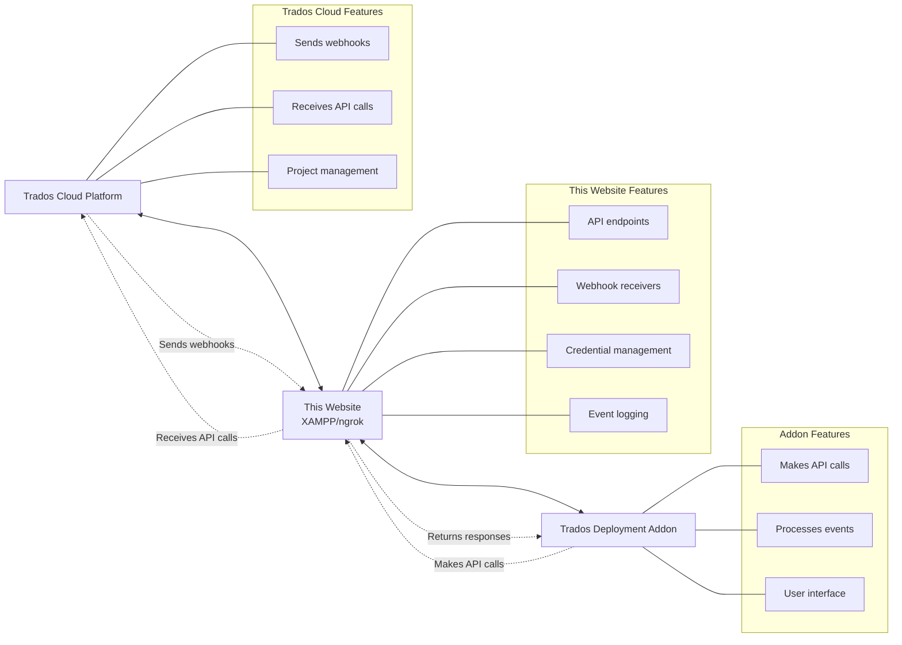

# Trados Integration Website

A local development website that enables developers to host API endpoints and webhook receivers for testing and developing Trados Cloud Platform integrations. This project provides the server-side component that communicates with the [Trados Deployment Addon](https://github.com/paulfilkin/trados-deployment-addon) through API calls and webhook events.

## Overview

This website serves as a local development platform for developers building Trados Cloud Platform integrations. It provides:

- **API endpoints** that the Trados deployment addon can call
- **Webhook receivers** for real-time events from Trados Cloud Platform
- **Local development environment** using XAMPP and ngrok for external accessibility
- **Integration management** for handling multiple addon instances and credentials

The primary purpose is to demonstrate how to set up a complete local development environment where developers can test API communication and webhook handling between their local server and the Trados deployment addon.

## Architecture



## Key Features

### API Communication Hub
- Provides REST API endpoints for the Trados deployment addon to interact with
- Handles authentication and credential management for Trados Cloud Platform
- Manages integration instances with secure credential storage
- Processes API requests from the addon and forwards them to Trados Cloud

### Webhook Event Processing
- Receives webhook events from Trados Cloud Platform in real-time
- Stores and logs all incoming webhook data for debugging and analysis
- Provides webhook event monitoring dashboard
- Demonstrates proper webhook validation and security practices

### Local Development Support
- Designed specifically for XAMPP local development environment
- ngrok integration instructions for exposing local endpoints externally
- Comprehensive logging and debugging tools for development
- Database viewer for inspecting all API and webhook data

### Integration Instance Management
- Create and manage multiple integration configurations
- Store Trados Cloud credentials securely (Client ID, Client Secret, Tenant ID)
- Track integration status and activity
- Support multiple concurrent addon instances

## Technical Requirements

### Local Development Stack
- **XAMPP**: Apache web server with PHP
- **ngrok**: For exposing local webhooks to external services
- **PHP**: Version 7.4 or higher with PDO SQLite support
- **SQLite**: Embedded database for storing integration data

### Development Environment Setup
```
Local Machine:
├── XAMPP (Apache + PHP)
├── ngrok (tunnel service)
├── This website project
└── Trados Deployment Addon
```

## Installation & Setup

### 1. XAMPP Installation & Configuration
```bash
# Install XAMPP and start Apache
# Place project in XAMPP htdocs directory
/xampp/htdocs/trados-integration/
```

### 2. Project Directory Structure
```
trados-integration/
├── index.php                          # Main dashboard
├── translation-files-manager.html     # File processing interface  
├── database-viewer.php               # Database inspection tool
├── includes/
│   ├── database.php                  # Database connection & setup
│   └── functions.php                 # Core API functions
├── api/
│   ├── create-integration.php        # Create integration instances
│   ├── process-translation-files.php # File processing API
│   ├── scan-translation-files.php    # File scanning API
│   ├── send-webhook.php             # Webhook testing endpoint
│   └── webhooks.php                 # Webhook receiver endpoint
├── translationfiles/                 # File processing directory
├── data/                            # SQLite database location
└── assets/                          # Static resources
```

### 3. ngrok Configuration for Webhook Development
```bash
# Install ngrok
# Start your XAMPP Apache server on port 80 (or 8080)
# Expose your local server externally:
ngrok http 80

# ngrok will provide a public URL like:
# https://abc123.ngrok.io -> http://localhost:80
```

### 4. Webhook Endpoint Configuration
Your webhook endpoint will be accessible at:
```
https://your-ngrok-url.ngrok.io/trados-integration/api/webhooks.php
```

Use this URL when configuring webhooks in Trados Cloud Platform.

## Usage for Addon Development

### Setting Up Integration Instances
1. Access the dashboard: `http://localhost/trados-integration/`
2. Create a new integration instance with your Trados Cloud credentials:
   - **Tenant ID**: Your Trados Cloud tenant
   - **Client ID**: OAuth application client ID
   - **Client Secret**: OAuth application secret
3. Note the generated Instance ID for use in the addon

### API Endpoints for Addon Communication

The website provides these endpoints for the Trados deployment addon:

#### Integration Management
```http
POST /api/create-integration.php
Content-Type: application/json

{
    "tenantId": "your-tenant-id",
    "clientId": "your-client-id", 
    "clientSecret": "your-client-secret"
}
```

#### File Processing
```http
POST /api/process-translation-files.php
Content-Type: application/json

{
    "instanceId": "integration-instance-id",
    "templateId": "project-template-id"
}
```

#### Webhook Testing
```http
POST /api/send-webhook.php
Content-Type: application/json

{
    "instanceId": "integration-instance-id",
    "eventType": "project.created"
}
```

### Webhook Event Reception

Configure Trados Cloud Platform to send webhooks to:
```
https://your-ngrok-url.ngrok.io/trados-integration/api/webhooks.php
```

The webhook receiver will:
- Validate incoming webhook authenticity
- Log all events to the database
- Display events in real-time on the dashboard
- Store event data for debugging and analysis

## Development Workflow

### 1. Local Environment Setup
```bash
# Start XAMPP Apache server
# Start ngrok tunnel
ngrok http 80

# Note your ngrok URL for webhook configuration
```

### 2. Addon Integration Testing
```bash
# Configure the Trados deployment addon to use your local API endpoints
# Set webhook URLs to your ngrok tunnel
# Test API communication between addon and your local website
```

### 3. Development & Debugging
- Use the database viewer to inspect all API calls and webhook events
- Monitor activity logs for detailed request/response information
- Test webhook delivery using the built-in webhook sender
- Verify integration instance status and credential handling

## Database Schema

The system automatically creates these tables for development:

### integration_controls
Stores addon integration instances and credentials
```sql
- instance_id (unique identifier)
- tenant_id (Trados Cloud tenant)
- client_id (OAuth client ID)
- client_secret (OAuth secret)
- status (active/inactive)
- created_at (timestamp)
```

### webhook_events
Logs all incoming webhook events
```sql
- event_id (auto-increment)
- event_type (webhook event type)
- payload (full JSON payload)
- timestamp (received time)
- instance_id (related integration)
```

### activity_logs
Development debugging and API call logging
```sql
- log_id (auto-increment) 
- level (info/error/debug)
- message (log message)
- details (additional data)
- timestamp (log time)
```

## Development Best Practices

### API Security
- All credentials stored securely in local SQLite database
- JWT token validation for webhook authenticity
- Instance-based access control for API endpoints
- Comprehensive request logging for security auditing

### Debugging & Monitoring
- Real-time webhook event monitoring
- Detailed API call logging with request/response data
- Database viewer for inspecting all stored data
- Activity logs with multiple severity levels

### ngrok Development Tips
- Use ngrok's web interface at `http://localhost:4040` to inspect requests
- Configure ngrok subdomain for consistent webhook URLs during development
- Monitor ngrok logs for connection issues and request debugging

## Integration with Trados Deployment Addon

This website is specifically designed to work with the [Trados Deployment Addon](https://github.com/paulfilkin/trados-deployment-addon). The integration workflow:

### Addon → Website Communication
- Addon makes API calls to your local website endpoints
- Website processes requests and communicates with Trados Cloud Platform
- Website returns responses to the addon

### Trados Cloud → Website Communication  
- Trados Cloud Platform sends webhooks to your ngrok-exposed endpoints
- Website receives and processes webhook events
- Website stores events for addon consumption

### Development Testing Flow
1. Start XAMPP and ngrok
2. Configure addon with your local API endpoints
3. Configure Trados Cloud webhooks with your ngrok URL
4. Test full round-trip communication: Addon → Website → Trados Cloud → Website

## Troubleshooting

### Common Development Issues

**ngrok Connection Problems**
- Verify ngrok is running and tunnel is active
- Check ngrok web interface for request logs
- Ensure firewall allows ngrok connections

**Webhook Reception Issues**
- Confirm webhook URL is your ngrok HTTPS URL
- Check webhook endpoint logs in database viewer
- Verify JWT token validation in activity logs

**API Communication Errors**
- Review API request/response logs in database
- Check XAMPP Apache error logs
- Verify integration instance credentials

**Database Issues**
- Ensure SQLite PHP extension is enabled
- Check file permissions on `/data/` directory
- Use database viewer to inspect table contents

### Development Debugging
```bash
# Check XAMPP logs
tail -f /xampp/logs/error_log

# Monitor ngrok requests
# Visit: http://localhost:4040

# Check website activity logs
# Use database viewer: /database-viewer.php
```


## Related Resources

- [Trados Deployment Addon](https://github.com/paulfilkin/trados-deployment-addon) - The companion addon project
- [Trados Cloud Platform API Documentation](https://eu.cloud.trados.com/lc/extensibility-docs) - Official API reference
- [ngrok Documentation](https://ngrok.com/docs) - Tunnel service for local development
- [XAMPP Documentation](https://www.apachefriends.org/docs/) - Local development environment